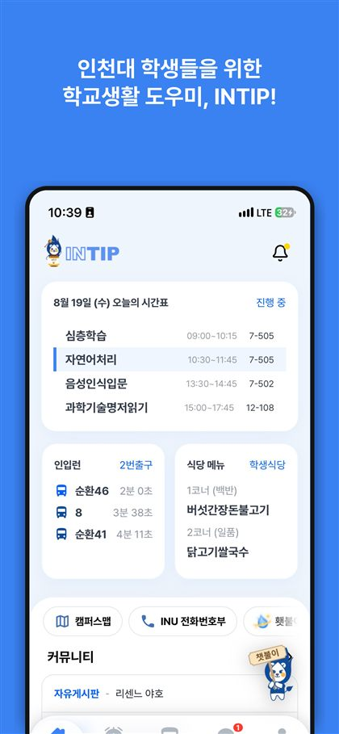
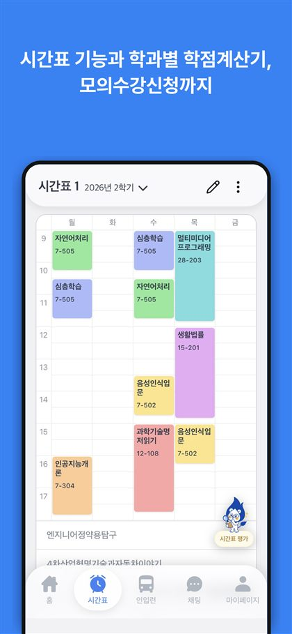
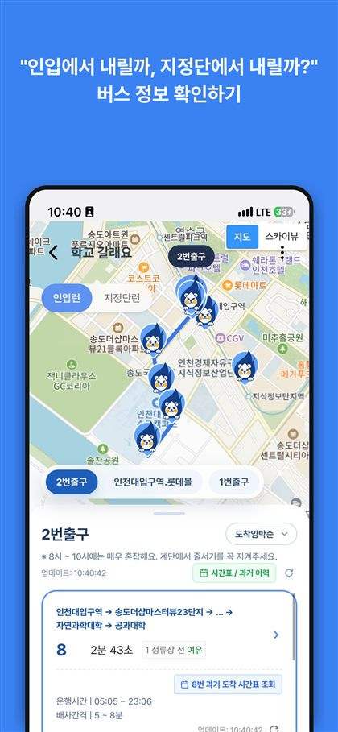
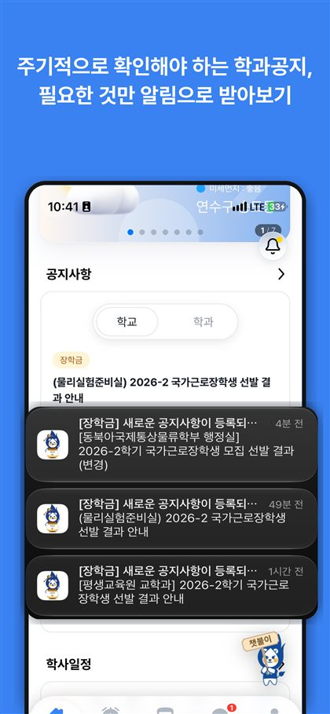
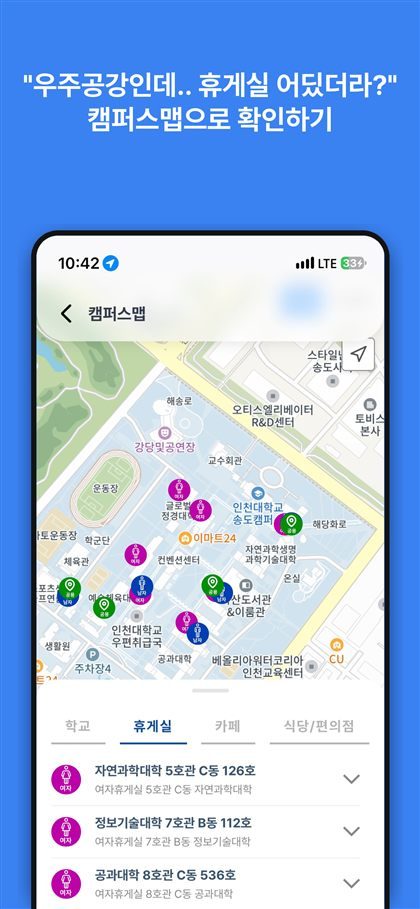
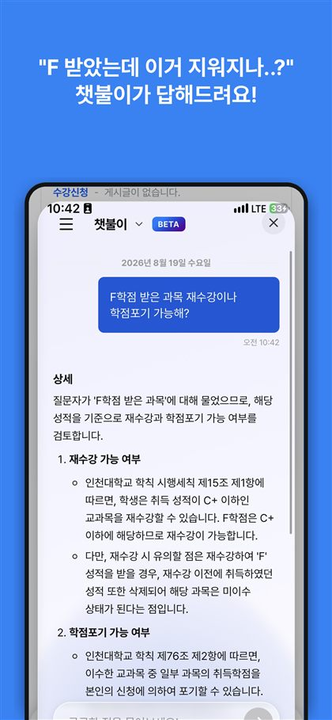
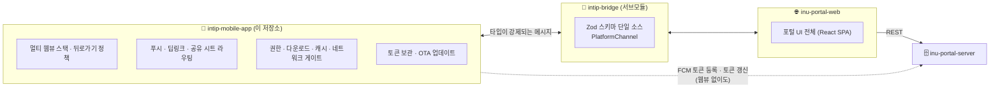
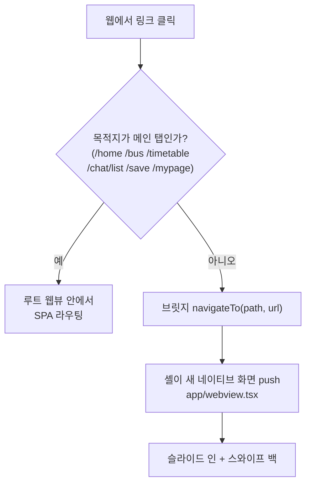
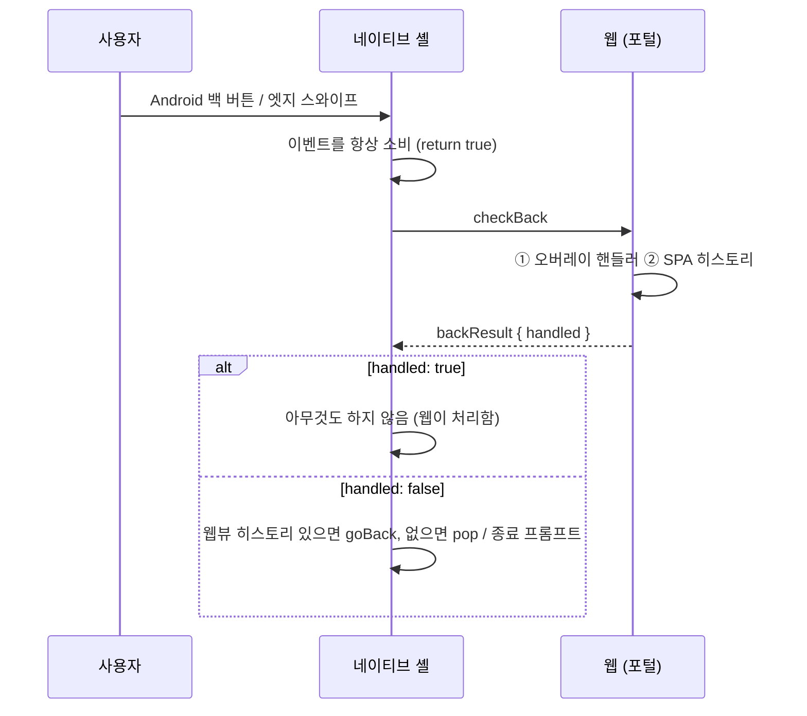
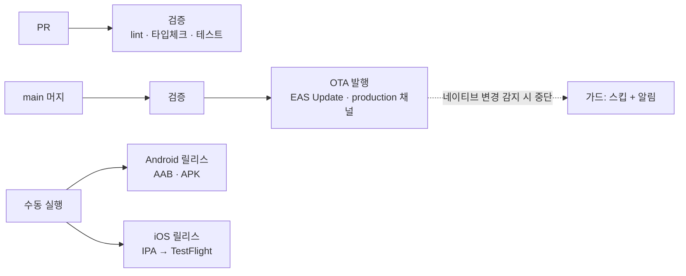

<div align="center">


### 인천대학교 학생을 위한 학교생활 도우미, INTIP

시간표 · 학식 · 셔틀버스 · 공지 · 커뮤니티 · 캠퍼스맵을 한 곳에서.<br/>
이 저장소는 그 포털을 감싸는 **iOS · Android 네이티브 앱**입니다.

<a href="https://apps.apple.com/us/app/intip-%EC%9D%B8%ED%8C%81-%EC%9D%B8%EC%B2%9C%EB%8C%80-%EA%B3%B5%EC%A7%80%EC%95%8C%EB%A6%AC%EB%AF%B8-%EC%9D%B8%EC%9E%85%EB%9F%B0-%EC%A0%84%ED%99%94%EB%B2%88%ED%98%B8%EB%B6%80/id6740070975?l=ko">
  
</a>
<a href="https://play.google.com/store/apps/details?id=inu.appcenter.intip_android">
  
</a>

<br/><br/>


<table>
  <tr>
    <td></td>
    <td></td>
    <td></td>
  </tr>
  <tr>
    <td></td>
    <td></td>
    <td></td>
  </tr>
</table>

</div>

---

### 목차

- [한 줄 요약](#한-줄-요약)
- [이 저장소가 맡는 일](#이-저장소가-맡는-일)
- [SPA + 네이티브 멀티 웹뷰 아키텍처](#아키텍처--spa--네이티브-멀티-웹뷰)
- [타입 안전한 브릿지 계약](#타입-안전한-브릿지-계약)
- [이런 문제를 이렇게 풀었습니다](#이런-문제를-이렇게-풀었습니다)
- [CI 파이프라인](#배포--ota-우선-네이티브-빌드는-필요할-때만)
- [프로젝트 구조](#프로젝트-구조)
- [코드가 지키는 규칙](#코드가-지키는-규칙)
- [시작하기](#시작하기)
- [함께 만들기](#함께-만들기)
- [관련 저장소와 문서](#관련-저장소와-문서)

---

## 한 줄 요약

INTIP은 **하이브리드 앱**입니다. 화면과 비즈니스 로직은 전부 웹 포털(SPA)에
있고, 이 저장소는 그 포털을 **네이티브처럼 보이게 하면서 네이티브만 할 수 있는 일을
해주는 wrapper**입니다. 포털 UI를 네이티브로 다시 구현한 곳은 한 군데도 없습니다.

기존에 안드로이드/iOS 각각 존재하는 앱을 하나로 합치면서, 멀티 웹뷰로의 전환도 같이 해 네이티브 앱과 비슷한 사용 경험을 제공하는 멀티 웹뷰 구조로 만들었습니다.

---

## 이 저장소가 맡는 일

INTIP의 프론트엔드는 세 개의 저장소로 나뉘어 있고, 이 저장소는 그중 **네이티브 래퍼**입니다.



셸이 실제로 해주는 것들:

| 영역 | 내용 |
| --- | --- |
| **화면 전환** | 서브페이지를 네이티브 스택으로 push, 슬라이드 인 애니메이션과 스와이프 백 구현 |
| **푸시 알림** | FCM 토큰 발급·갱신·서버 등록, 알림 탭 → 목적지 라우팅, 콜드 스타트 대응 |
| **딥링크** | iOS Universal Links / Android App Links로 포털 링크를 앱으로 |
| **공유 시트** | 스마트캠퍼스에서 복사한 성적표를 공유 → 학점계산기로 바로 가져오기 |
| **인증** | 웹이 받은 JWT를 SecureStore에 미러링, 만료 시 셸이 직접 리프레시 |
| **OS 기능** | 카메라·위치 권한 프라이밍, 파일 다운로드, 외부 링크 핸드오프, 캐시 정리, 네트워크 게이트 |
| **배포** | OTA 업데이트 확인·설치 프롬프트 |

---

## 아키텍처 — SPA + 네이티브 멀티 웹뷰

포털은 SPA지만, **모든 화면이 웹뷰 하나 안에서 바뀌면 앱처럼 느껴지지
않습니다.** 그래서 화면 전환을 두 갈래로 나눴습니다.



- **메인 탭**은 항상 살아 있는 **루트 웹뷰** 안에서 SPA로 전환됩니다. 
- **그 외 모든 페이지**(게시글 상세, 채팅방, 학점계산기…)는 웹이
  `navigateTo(path, url)`를 호출하면 셸이 **새 네이티브 웹뷰 화면을 push**, `goBack`이 pop 합니다.
- 웹은 User-Agent 접미사 `INTIPApp/1.0.0`과 브릿지 객체의 존재로 공식 앱을
  감지해, 브라우저일 때와 다른 라우팅을 씁니다.

여기서 하나 문제가 있습니다. `react-native-webview`는 `postMessage` 채널
**하나**만 노출하는데, 웹은 이미 예전 네이티브 앱에 맞춰
`window.AndroidBridge.*`(Android)와 `window.webkit.messageHandlers.*`(iOS)를
호출하도록 짜여 있었습니다. 그래서 셸이 그 객체들을 **주입 스크립트로 다시
만들어** 단일 채널로 넘깁니다. 웹의 환경 감지와 라우팅 코드는 한 줄도 바꾸지
않고 그대로 동작합니다.

> 자세한 하이브리드 인터페이스 문서: [`docs/requirement-ux-improvement.md`](docs/requirement-ux-improvement.md)

---

## 타입 안전한 브릿지 인터페이스

웹뷰와 웹페이지는 `postMessage(JSON.stringify(...))` 를 통해 메시지를 주고 받습니다. 문자열로 주고 받게 되어 있습니다. 이 문자열에 JSON을 직렬화 해서 넣어 규격화했습니다. 이 때 양측 인터페이스를 통일하기 위해 인터페이스만 별도 저장소
([`intip-bridge`](https://github.com/inu-appcenter/intip-bridge))로 떼어내
**git 서브모듈**로 양쪽(`intip-mobile-app`, `inu-portal-web`)이 소스째 컴파일합니다.

```ts
// packages/intip-bridge/src/messages.ts — 모든 메시지의 단일 소스
const webToNativeSchema = z.discriminatedUnion("event", [
  def("navigateTo", NavigateToPayload),   // { path, url }
  def("syncTokenInfo", TokenInfoPayload), // JWT 한 쌍
  def("backResult", z.object({ handled: z.boolean() })),
  voidDef("goBack"),
  // …
]);
```

- **컴파일 타임**: `event`별 `value` 타입이 discriminated union으로 강제됩니다.
  오타 난 이벤트 이름이나 잘못된 페이로드는 tsc가 잡습니다.
- **런타임**: 경계에서 Zod가 검증합니다. 구버전 앱과 신버전 웹이 공존하는
  하이브리드 앱에서는 "상대가 내가 모르는 메시지를 보낸다"가 정상 상황이라,
  검증 실패가 앱을 죽이지 않고 로깅으로 끝나야 합니다.
- **`PlatformChannel`**: 운반 수단(웹의 `window.postMessage`, 네이티브의
  `onMessage`)을 추상화해서, 앱 코드는 `channel.send(event, value)` /
  `channel.on(event, handler)`만 다룹니다. `request()`/`reply()`로 **요청-응답**
  상관관계도 지원합니다 — 뒤로가기 위임(아래)이 이걸 씁니다.

인터페이스는 서브모듈로 존재합니다. 모노레포는 복잡성이 커지고, 별도 패키지를 따로 구성하기에는 해당 패키지의 관리 부담이 생겨 이와 같이 관리합니다.

---

## 이런 문제를 이렇게 풀었습니다

### 1. 뒤로가기는 셸이 판단하면 안 된다

#### **문제**
채팅방(서브페이지)에서 이미지 뷰어를 열어둔 채 뒤로가기를 하면,
이미지만 닫혀야 하는데 **채팅방 화면이 통째로 닫혔습니다.**

#### **원인**
 웹뷰 안에 모달이 떠 있는지, 되돌릴 SPA 히스토리가 있는지를 아는 쪽은
**웹뿐**입니다. 셸은 그걸 모른 채 "서브페이지니까 pop"을 실행했습니다.

#### **해결**
셸이 판단을 포기하고 **웹에 위임**했습니다. 뒤로가기가 들어오면
`checkBack`을 웹에 보내고, 웹의 `backResult`를 받아 결정합니다.



**핵심은 응답이 오지 않는 경우입니다.** 웹이 로딩 중이거나, JS 스레드가
막혔거나, `checkBack`을 모르는 **구버전 웹**이 올라와 있을 수 있습니다.
그래서 350ms 타임아웃을 두고, 무응답 폴백을 **위임 도입 전의 동작과 똑같이**
맞췄습니다. 덕분에 구버전 웹에서도 회귀가 없습니다.

Android 엣지 스와이프가 `BackHandler`를 거치도록 `predictiveBackGestureEnabled`를
끄고, 네이티브 스택 제스처는 페이지에 묻지 않고 화면을 닫아버리므로 양 플랫폼
모두에서 껐습니다. 정책 자체는 React에 의존하지 않는 순수 함수
(`src/webview/backPolicy.ts`)라 단위 테스트로 검증합니다.

> [`docs/back-navigation-policy.md`](docs/back-navigation-policy.md) · PR #18

### 2. 알림 · 딥링크 · 공유 시트를 하나의 목적지 타입으로

앱 밖에서 들어오는 진입점은 세 가지입니다. 푸시 알림 탭, 포털 링크(딥링크),
그리고 OS 공유 시트(스마트캠퍼스 성적표 → 학점계산기). 셋이 각자 라우팅을
구현하면 규칙이 세 벌로 갈라집니다.

그래서 전부 **하나의 `NavIntent`**로 번역한 뒤 같은 디스패처에 넣습니다.

```ts
export type NavIntent =
  | { kind: 'spa';      path: string }              // 메인 탭 → 루트 SPA를 이동
  | { kind: 'push';     path: string; url: string } // 그 외 → 네이티브 화면 push
  | { kind: 'external'; url: string };              // 허용된 외부 호스트 → 인앱 브라우저
```

번역기들(`push/navIntent.ts`, `links/deepLink.ts`, `share/gradeShareIntent.ts`)은
네이티브 모듈을 import하지 않는 순수 함수라 전부 단위 테스트 대상입니다.

여기서 실제로 부딪힌 문제 두 가지:

- **콜드 스타트.** 알림 탭으로 앱이 켜지면, 인텐트는 루트 웹뷰가 mount되기
  **전에** 도착합니다. 그래서 대기 큐를 모듈 스코프에 둡니다 — 훅 스코프
  큐는 자기가 생기기 전에 도착한 것을 받을 수 없으니까요.
- **같은 화면이 겹겹이 쌓임.** 한 채팅방의 알림 여러 개를 연달아 탭하면
  같은 채팅방이 n개 열렸습니다. 알림 ID 기반 중복 제거는 "한 번의 탭이 두 경로로
  보고되는" 경우만 잡지, 서로 다른 알림은 못 잡습니다. 그래서 **목적지 기준**으로
  스택을 조회해, 이미 열려 있으면 push 대신 그 화면으로 돌아갑니다
  (`src/webview/subPageStack.ts`).

알림 페이로드는 신뢰 경계 밖이라, 포털 외 호스트는 **허용 목록**에 있을 때만
인앱 브라우저로 열고 나머지는 무시합니다.

> PR #9 · #20 · #22

### 3. 웹뷰가 없어도 서버를 호출해야 했다

FCM 토큰은 앱이 백그라운드일 때도 회전(`onTokenRefresh`)합니다. 그런데 토큰
등록은 인증이 필요한 API고, JWT는 웹이 갖고 있습니다. 웹뷰가 살아 있지 않으면
등록할 방법이 없었습니다.

그래서 웹이 로그인/리프레시로 얻은 토큰 쌍을 브릿지로 넘겨받아
**`expo-secure-store`에 미러링**하고, 셸이 필요할 때 스스로 만료를 확인해
리프레시까지 합니다(`src/native/authTokens.ts`). 네이티브가 갱신한 토큰은
다시 웹으로 돌려보내 양쪽 상태를 맞춥니다.

작지만 실제로 물렸던 함정: 서버가 주는 만료 시각은
`"2026-01-22T23:25:47.754524713"` 같은 **타임존 없는 naive datetime**입니다.
`new Date(str + "Z")`로 UTC 취급하면 UTC가 아닌 기기에서 전부 어긋납니다.
기존 Android 클라이언트의 `LocalDateTime` 비교와 동일하게 **기기 로컬 시각**으로
파싱합니다.

### 4. 권한 팝업이 화면을 열 때마다 떴다

카메라·위치 권한을 로그인 직후에 한꺼번에 요청했더니, 서브페이지를 push할
때마다 그 화면의 `loginSuccess` 핸들러가 다시 프라이밍을 돌렸습니다. 시간표를
편집하려는 사용자에게 위치 권한 팝업이 뜨는 식이었죠.

지금은 **앱 세션당 한 번**, 그리고 **페이지가 실제로 `navigator.geolocation`을
호출한 첫 순간**에만 요청합니다. 이 신호는 브릿지 계약에 넣지 않고 별도 마커로
주고받습니다 — 웹이 알 필요가 없는 네이티브 전용 신호를 계약에 넣으면 저장소
두 곳의 스키마 bump를 강요하게 되니까요. 카메라는 두 웹뷰 엔진 모두 호출
시점에 OS가 직접 물어보므로 프라이밍이 필요 없었습니다.

> PR #14 · #21

### 5. 전환 중에 흰색/검은색으로 번쩍이는 문제

서브페이지를 push하면 콜드 로드가 끝나기 전까지 빈 배경 카드가 슬라이드 인
되고, 로드가 끝나는 순간 내용이 튀어나왔습니다. 지금은 테마 색 오버레이를
덮은 채 밀어 넣고, 준비되면 크로스페이드로 걷어냅니다. 로드 신호와 안전
타임아웃이 경쟁하되 **먼저 도착한 쪽이 페이드를 소유**하도록 멱등하게 짰습니다.

루트 웹뷰는 같은 오버레이로 실행 시 서비스워커/캐시 정리까지 가립니다. 웹이
정리 완료를 알려주면 걷힙니다.

---

## 배포 — OTA 우선, 네이티브 빌드는 필요할 때만



- **OTA(EAS Update)** — 자동. `main`에 머지될 때마다 검증 후 `production`
  채널로 발행됩니다. JS와 에셋 변경은 스토어 심사 없이 사용자에게 도달합니다.
- **네이티브 릴리스** — 수동. Actions 탭에서 작업을 골라 실행합니다.
  Android는 서명된 AAB/APK를, iOS는 IPA를 만들어 TestFlight로 올립니다.
- **비용** — 모든 잡이 self-hosted 러너(macOS) 한 대에서 돕니다. private
  저장소라 GitHub-hosted는 분 단위 과금이고 macOS는 단가가 10배여서, iOS 빌드
  한 번이 무료 분을 크게 깎아먹었습니다.
- **iOS buildNumber 자동화** — App Store Connect API로 이미 올라간 최대
  `CFBundleVersion`을 조회해 +1을 씁니다. 커밋마다 손으로 올리다 중복
  업로드로 거부(-19232)당하던 일을 없앴습니다.

> 시크릿 목록, 채널 매핑 함정, 서명 스크립트까지 —
> [`docs/development.md`](docs/development.md)

---

## 프로젝트 구조

```
src/
├── app/                        # expo-router 화면
│   ├── _layout.tsx             #   스택: 루트(스와이프 없음) + push된 서브페이지
│   ├── index.tsx               #   네트워크 게이트 → 루트 웹뷰
│   ├── webview.tsx             #   push된 서브페이지 웹뷰
│   └── +native-intent.ts       #   딥링크 → NavIntent
├── components/
│   ├── WebViewContainer.tsx    # 웹뷰 한 개 + 브릿지 전체 배선 (root | sub)
│   └── WebViewControllerPanel.tsx  # 개발용 컨트롤러 GUI
├── webview/
│   ├── constants.ts            # 포털 URL, 메인 탭 경로, UA, 딥링크 허용 호스트
│   ├── injectedScript.ts       # 브릿지 shim · 라우트 옵저버 · 세이프에어리어 주입
│   ├── bridge.ts               # 네이티브 채널 결선
│   ├── backPolicy.ts           # 뒤로가기 판정 (순수)
│   ├── subPageStack.ts         # 목적지 기준 스택 조회 (순수)
│   ├── sessionSnapshot.ts      # 개발용 세션 직렬화 (순수)
│   └── WebViewContext.tsx      # 여러 웹뷰를 묶는 오케스트레이터
├── push/
│   ├── messaging.ts            # FCM 초기화 · 토큰 · notifee · 탭 처리
│   ├── navIntent.ts            # 알림 payload → NavIntent (순수)
│   └── pendingIntent.ts        # 콜드 스타트 대기 큐 + 중복 제거
├── links/deepLink.ts           # Universal / App Links → NavIntent (순수)
├── share/gradeShareIntent.ts   # 공유 시트 텍스트 → NavIntent (순수)
├── native/                     # 토큰 보관 · 캐시 · 권한 · 다운로드 · 네트워크 · OTA
└── theme.ts

packages/intip-bridge/          # 브릿지 계약 (git 서브모듈, 소스째 컴파일)
modules/intip-native-dialog/    # 로컬 Expo 모듈 (Android 네이티브 다이얼로그)
plugins/                        # config plugin (알림 채널, 서명)
scripts/                        # App Store Connect API · 테스트 푸시 발송
docs/                           # 명세와 결정 기록
```


---

## 시작하기

```bash
# 1. 서브모듈까지 클론
git clone --recurse-submodules https://github.com/inu-appcenter/intip-mobile-app.git
cd intip-mobile-app

# 2. Firebase 설정 파일을 루트에 배치 (gitignore 대상)
#    ./GoogleService-Info.plist  ·  ./google-services.json

# 3. 설치 → 네이티브 생성 → 개발 빌드 실행
npm install
npx expo prebuild
npx expo run:ios        # 또는 npx expo run:android

# 4. 검증
npm test && npm run typecheck && npm run lint
```

네이티브 모듈을 쓰기 때문에 **Expo Go로는 실행되지 않습니다.** `ios/`와
`android/`는 `expo prebuild` 산출물(CNG)이라 저장소에 커밋되지 않으니, 직접
고치지 말고 `app.json`이나 `plugins/`를 수정하세요.

> 환경변수, CI 시크릿, 푸시 테스트, 디버깅 도구까지 —
> [`docs/development.md`](docs/development.md)

---

## 함께 만들기

INU App Center에서 인천대 학생들이 만들고 운영합니다. 기여를 환영합니다.

**이런 걸 만져볼 수 있습니다**

- 하이브리드 앱의 **화면 전환 UX** — 멀티 웹뷰 스택, 전환 애니메이션,
  제스처 뒤로가기
- **네이티브↔웹 계약 설계** — Zod 스키마, 요청-응답 채널, 하위 호환
- **모바일 배포 자동화** — EAS Update, 코드 서명, TestFlight, self-hosted 러너
- **웹뷰의 어두운 구석** — WKWebView/Chromium 동작 차이, 주입 스크립트,
  세이프에어리어, 권한

**시작하기 좋은 지점**

1. [`docs/requirement-ux-improvement.md`](docs/requirement-ux-improvement.md)로
   하이브리드 계약을 먼저 읽고,
2. [`src/webview/`](src/webview)의 순수 모듈들(`backPolicy`, `subPageStack`,
   `constants`)을 테스트와 함께 보면 셸이 무슨 판단을 하는지 빠르게 잡힙니다.
3. 브릿지 계약을 바꾸는 작업이라면
   [`AGENTS.md`](AGENTS.md)의 서브모듈 절차를 꼭 먼저 확인하세요 — 저장소 세
   곳이 함께 움직입니다.

**규칙 몇 가지**

- PR을 올리면 CI가 lint · 타입체크 · 테스트를 돌립니다. 판단 로직을 추가했다면
  테스트도 함께 부탁드립니다.
- 네이티브 설정(`app.json`, `plugins/`, `modules/`)을 건드렸다면 OTA로 나갈 수
  없습니다. PR 설명에 적어주세요.
- 커밋 메시지는 `feat:` / `fix:` / `ci:` / `chore:` 접두사를 씁니다.

---

## 관련 저장소와 문서

| 저장소 | 역할 |
| --- | --- |
| [`inu-portal-web`](https://github.com/inu-appcenter/inu-portal-web) | 포털 UI 전체 (React SPA) — 앱이 감싸는 대상 |
| [`intip-bridge`](https://github.com/inu-appcenter/intip-bridge) | 네이티브↔웹 메시지 계약 (Zod 단일 소스) |
| `inu-portal-server` | 백엔드 API |

| 문서 | 내용 |
| --- | --- |
| [`docs/development.md`](docs/development.md) | 개발 환경, 배포 파이프라인, 디버깅 도구 |
| [`docs/requirement-ux-improvement.md`](docs/requirement-ux-improvement.md) | 하이브리드 계약 — 멀티 웹뷰 라우팅 + 브릿지 명세 |
| [`docs/requirement-scratch.md`](docs/requirement-scratch.md) | 기존 SwiftUI 앱에서 옮겨온 기능 패리티 명세 |
| [`docs/back-navigation-policy.md`](docs/back-navigation-policy.md) | 뒤로가기 역할 분담 (셸 / 웹) |
| [`docs/push-notification-routing/`](docs/push-notification-routing) | 알림 탭 라우팅 설계와 수동 QA 절차 |
| [`docs/requirement-content-moderation.md`](docs/requirement-content-moderation.md) | App Store 심사(UGC 가이드라인) 대응 요구사항 |
| [`AGENTS.md`](AGENTS.md) | 저장소 규칙 — 서브모듈 절차, Expo 버전 고정 |

---

## Contributor History

- [26.06 - 인팁 5기 FE 최경민](https://github.com/KimWash)

<div align="center">

**INTIP** · 인천대학교 App Center<br/>
<sub>MIT License · © 2026 INU AppCenter</sub>

</div>
