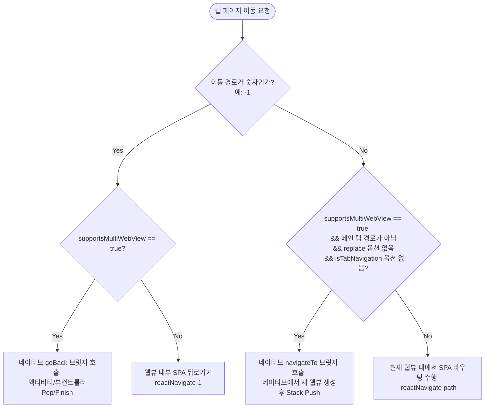

본 문서는 **INTIP(인팁)** 프로젝트의 웹 프론트엔드와 모바일 네이티브 앱(Android 및 iOS) 간의 통신 규격, 멀티 웹뷰 라우팅 아키텍처, 브릿지 인터페이스 명세를 상세히 다룹니다. Android와 iOS 두 네이티브 플랫폼의 실제 구현 내용을 바탕으로 하이브리드 연동 표준 규격을 기술합니다.

---

## 1. 개요 및 하이브리드 아키텍처

INTIP 서비스는 단일 웹뷰에서 모든 페이지가 이동하는 기존 하이브리드 방식의 단점(화면 전환 애니메이션의 부재, 네이티브 제스처 뒤로가기 미지원, 스크롤 스터터링 등)을 보완하기 위해 **SPA(Single Page Application)와 네이티브 멀티 웹뷰(Multi-WebView) 스택이 혼합된 구조**를 채택하고 있습니다.

- **메인 탭 화면**: 단일 메인 웹뷰 액티비티/뷰컨트롤러 내에서 React Router를 사용한 SPA 방식으로 화면을 전환합니다.
- **서브 페이지 (상세 화면 등)**: 메인 탭이 아닌 상세 화면으로 진입할 시, 네이티브가 새로운 웹뷰 컨테이너(Android: `WebViewActivity`, iOS: `WebViewController`)를 생성하여 화면 위에 스택처럼 푸시(Push)합니다.
- **뒤로가기**: 서브 페이지에서 뒤로가기를 호출하면 해당 네이티브 웹뷰 컨테이너만 팝(Pop/Finish)되어 이전 화면이 자연스럽게 드러납니다.

---

## 2. 환경 감지 규격 (Environment Detection)

웹앱은 자신이 실행 중인 환경이 공식 앱(신버전/구버전)인지, 혹은 모바일 브라우저인지 판단하여 서로 다른 라우팅 및 브릿지 동작을 수행합니다.

### A. User-Agent 규격

네이티브 앱은 웹뷰를 초기화할 때, 시스템의 기본 User-Agent 문자열 뒤에 아래의 식별용 접미사(Suffix)를 공통으로 추가해야 합니다. (띄어쓰기 한 칸 포함)

```
 INTIPApp/1.0.0
```

- **Android 적용 코드 예시 (`WebViewActivity.kt`)**:
    
    ```kotlin
    webView.settings.userAgentString += " INTIPApp/1.0.0"
    ```
    
- **iOS 적용 코드 예시 (`WebViewController.swift`)**:
    
    ```swift
    webView.evaluateJavaScript("navigator.userAgent") { [weak self] (result, error) in
        if let defaultUA = result as? String {
            self?.webView.customUserAgent = defaultUA + " INTIPApp/1.0.0"
        }
    }
    ```
    

### B. 웹의 환경 판정 조건 및 코드 (`getMobilePlatform.ts`)

웹 프론트엔드는 다음 조건에 따라 앱의 버전을 분류합니다.

| 환경 분류 (`AppEnvironmentStatus`) | 판정 기준 |
| --- | --- |
| **`NEW_APP`** (신버전 공식 앱) | **[Android]** UA에 `"INTIPApp"`이 포함되거나 `window.AndroidBridge`가 존재하고, 동시에 `window.AndroidBridge.navigateTo` 함수가 정의되어 있음.<br>**[iOS]** `window.webkit.messageHandlers.requestAppUpdate`가 존재하고, 동시에 UA에 `"INTIPApp"`이 포함되어 있음. |
| **`OLD_APP`** (구버전 공식 앱) | 공식 앱 환경이나 신규 멀티 웹뷰 브릿지(`navigateTo`)를 지원하지 않는 경우. |
| **`BROWSER`** (일반 브라우저) | 위의 공식 앱 감지 조건이 모두 맞지 않는 경우 (크롬, 사파리 및 카카오톡/인스타 인앱 브라우저 등). |

---

## 3. 라우팅 및 멀티 웹뷰 스펙 (Multi-WebView Routing Spec)

가장 핵심이 되는 사양으로, 웹에서의 링크 클릭 및 이동 시 어떤 흐름을 거치는지 정의합니다.

### A. 메인 탭 경로 정의

다음 경로는 웹과 앱에서 **메인 탭**으로 규정하며, 멀티 웹뷰를 띄우지 않고 단일 웹뷰 내에서 SPA 라우팅으로만 전환합니다.

- `/` (루트)
- `/home` (홈)
- `/bus` (버스 노선/예약)
- `/chat/list` (채팅 목록)
- `/save` (보관함)
- `/mypage` (마이페이지)
- `/timetable` (시간표)
- *(모바일 경로 접두사 `/m`이 붙은 동일 경로 포함)*

### B. 라우팅 분기 처리 로직 (`useCustomNavigate.ts` 및 `router.tsx`)

웹 프론트엔드는 React Router의 `navigate` 이벤트를 가로채거나 래핑 훅(`useCustomNavigate`)을 사용해 분기 처리합니다.



### 1. 뒤로가기 (`path === -1`)

- `supportsMultiWebView()`가 참이면 **네이티브 브릿지 `goBack()`을 호출**하고 동작을 끝냅니다.
- 그 외 브라우저 환경에서는 기존 React Router 혹은 브라우저 히스토리(`history.go(-1)`)로 이동합니다.

### 2. 페이지 이동 (`path`가 문자열)

- `supportsMultiWebView()`가 참이고, 이동하려는 경로가 **메인 탭 경로가 아니며**, 단순 페이지 덮어쓰기(`replace: true`)나 메인 탭 강제 전환(`isTabNavigation: true`)이 아닐 경우:
    - **네이티브 브릿지 `navigateTo(path, fullUrl)`을 호출**하고, 웹뷰 자체의 SPA 라우팅 처리는 `Promise.resolve()`를 리턴하여 **중단(Skip)**합니다.
- 그 외 환경(브라우저, 구버전 앱, 메인 탭 간 이동 등)에서는 일반 웹 라우팅(`navigate(path)`)을 수행합니다.

### C. 네이티브의 멀티 웹뷰 구현 명세

### 1. Android 구현 방식 (`WebViewActivity.kt`)

- **새 웹뷰 띄우기 (`navigateTo` 수신 시)**:
    - 새로운 `WebViewActivity`를 시작합니다. Intent Extra로 전달받은 절대 URL을 새 웹뷰에 로드합니다.
    - 화면 전환 애니메이션으로 **우측에서 좌측으로 슬라이드 인**(`R.anim.slide_in_right`, `R.anim.slide_out_left`)을 적용합니다.
- **뒤로가기 (`goBack` 수신 또는 시스템 뒤로가기 버튼 클릭 시)**:
    - 현재 서브 `WebViewActivity`를 종료(`finish()`)합니다.
    - 화면 전환 애니메이션으로 **좌측에서 우측으로 슬라이드 아웃**(`R.anim.slide_in_left`, `R.anim.slide_out_right`)을 적용합니다.

### 2. iOS 실제 구현 방식 (`WebViewController.swift` & `ContentView.swift`)

- **루트 컨트롤러 구성**:
    - SwiftUI 진입점의 `ContentView`에서 네트워크 검사가 완료되면 `NavigationStackContainer` 구조체를 호출해 UIKit의 `UINavigationController`를 활성화합니다. (상단 내비게이션 바 숨김 처리)
- **새 웹뷰 띄우기 (`navigateTo` 수신 시)**:
    - `navigateTo` 메시지 수신 시 웹뷰 내에서 전달받은 절대 URL을 추출합니다.
    - 새로운 `WebViewController(urlString: url)`를 인스턴스화하고, `navigationController?.pushViewController(nextVC, animated: true)`를 실행해 내비게이션 스택 위에 밀어 넣습니다. (iOS 기본 애니메이션에 의해 우측에서 좌측으로 자연스럽게 슬라이드 푸시가 일어남)
- **뒤로가기 (`goBack` 수신 시)**:
    - `navigationController?.popViewController(animated: true)`를 호출하여 현재 최상위 뷰컨트롤러를 스택에서 걷어냅니다.
- **스와이프 뒤로가기 제스처 (`interactivePopGestureRecognizer`) 제어**:
    - `UIGestureRecognizerDelegate`를 상속받아, 뷰컨트롤러 내에서 내비게이션 스택의 개수 및 메인 탭 여부를 판단합니다.
    - 메인 탭(`isMainTab`)에서는 내비게이션 스와이프 제스처를 비활성화(`isEnabled = false`)하여 의도치 않은 화면 찢어짐이나 이동을 방지합니다.
    - 서브 상세 페이지에서는 제스처를 활성화(`isEnabled = true`)하여, 사용자가 스와이프 시 뷰컨트롤러가 네이티브 Pop 처리되도록 동작을 안드로이드의 뒤로가기 시스템과 일치시켰습니다.

---

## 4. 웹 → 네이티브 브릿지 규격 (Web to Native API)

웹에서 네이티브의 하드웨어/플랫폼 기능을 호출하기 위해 아래의 브릿지 메서드를 구현합니다.

### A. Android 브릿지 명세

Android에서는 `AndroidBridge`라는 이름의 자바스크립트 인터페이스 객체로 주입합니다.

- **등록 명칭**: `"AndroidBridge"`
- **인터페이스 명세 (`WebAppInterface.kt`)**:

```kotlin
class WebAppInterface {
    @JavascriptInterface
    fun navigateTo(destination: String, url: String)

    @JavascriptInterface
    fun goBack()

    @JavascriptInterface
    fun requestAppUpdate()

    @JavascriptInterface
    fun openAppSettings()

    @JavascriptInterface
    fun requestPermissionSettings()

    @JavascriptInterface
    fun logWebDiagnostics(payload: String)

    @JavascriptInterface
    fun onLaunchWebCleanupFinished(payload: String)
}
```

### B. iOS 브릿지 명세

iOS WebKit 환경에서는 `window.webkit.messageHandlers` 객체를 활용한 메시지 전송 방식으로 구현합니다.

- **등록 명칭**: 각 메서드 이름을 독립적으로 등록하여 처리합니다.
- **핸들러 명세 (`WebViewController.swift`)**:

| 메시지 핸들러 이름 | 수신 메시지 포맷 (`message.body`) | 네이티브 액션 설명 |
| --- | --- | --- |
| **`navigateTo`** | `Dictionary` (예: `["path": "/board/12", "url": "https://..."]`) | 수신한 절대 URL 주소로 새로운 웹뷰 뷰컨트롤러(`WebViewController`)를 Push합니다. |
| **`goBack`** | `nil` (또는 임의의 값) | 최상위 웹뷰 뷰컨트롤러를 Pop합니다. |
| **`requestAppUpdate`** | `nil` (또는 임의의 값) | 앱 캐시를 강제 삭제하고 첫 화면으로 리로드(업데이트 확인 모달을 통한 트리거)합니다. |
| **`loginSuccess`** | `String` (예: `"ok"`) | 로그인 성공 시 웹에서 전달되며, 네이티브는 최신 FCM 토큰을 갱신 및 재조회하여 웹뷰로 전달합니다. |
| **`onLaunchWebCleanupFinished`** | `String` (예: `"done"`) | 기동 시 서비스워커 및 캐시 정리 스크립트 실행이 끝났음을 확인하고 로딩 오버레이 스크린을 해제합니다. |

---

## 5. 네이티브 → 웹 메시징 규격 (Native to Web API)

네이티브 앱에서 웹뷰 내부의 특정 자바스크립트 환경이나 이벤트를 호출하여 상태를 동기화합니다.

### A. FCM 토큰 전달 (FCM Token Injection)

사용자가 로그인 상태에 진입하거나 페이지 로드가 완료될 때, 앱은 저장 또는 발급된 Firebase Cloud Messaging 토큰을 웹뷰에 직접 주입해야 합니다.

- **실행할 JS 스크립트 규격**:
    
    ```jsx
    window.onReceiveFcmToken && window.onReceiveFcmToken("FCM_TOKEN_STRING");
    ```
    
- **호출 타이밍**:
    1. 웹뷰 페이지의 로드가 완전히 완료되었을 때 (`onPageFinished` / `didFinish navigation`)
    2. 웹에서 `loginSuccess` 메시지 핸들러를 호출했을 때
    3. 앱이 백그라운드에서 포그라운드로 복귀하며 최신 토큰이 확인되었을 때

### B. 서비스 워커 및 캐시스토리지 강제 정리 (런칭 클린업 이벤트 루프)

웹 서비스 업데이트 시 발생할 수 있는 캐시 충돌 및 구버전 서비스워커 오작동 방지를 위해 앱 기동 시 강제 클린업 이벤트 루프를 실행합니다.

### Android / iOS 공통 클린업 프로세스

1. 앱 최초 구동 시 네이티브 영역에 로딩 스피너 및 오버레이 화면(`splashOverlay` / 스플래시 대기 상태)을 유지합니다.
2. 첫 페이지 로드가 완료되면, 네이티브에서 다음 클린업 스크립트를 웹뷰 내에 강제로 주입 및 실행합니다.
    
    ```jsx
    (function() {
      const tasks = [];
      try {
        if ('serviceWorker' in navigator) {
          tasks.push(
            navigator.serviceWorker.getRegistrations()
              .then(function(regs) {
                return Promise.allSettled(regs.map(reg => reg.unregister()));
              })
          );
        }
      } catch (e) {}
      try {
        if ('caches' in window) {
          tasks.push(
            caches.keys().then(names => Promise.allSettled(names.map(name => caches.delete(name))))
          );
        }
      } catch (e) {}
      Promise.allSettled(tasks).then(function() {
        if (window.AndroidBridge && window.AndroidBridge.onLaunchWebCleanupFinished) {
          window.AndroidBridge.onLaunchWebCleanupFinished("done");
        }
        if (window.webkit?.messageHandlers?.onLaunchWebCleanupFinished) {
          window.webkit.messageHandlers.onLaunchWebCleanupFinished.postMessage("done");
        }
      });
    })();
    ```
    
3. 웹뷰 내부 클린업 연산이 끝나면 해당하는 브릿지(`onLaunchWebCleanupFinished`)를 호출합니다.
4. 네이티브가 이 신호를 감지하면 비로소 로딩 스피너 오버레이 화면을 페이드 아웃 소멸시키고 화면을 완전히 노출합니다.

---

## 6. 모바일 네이티브 앱 세부 설정 가이드

하이브리드 앱의 완성도를 높이기 위해 Android/iOS 공통으로 지켜야 하는 웹뷰 엔진 환경 구성입니다.

1. **DOM Storage & JavaScript 활성화**:
    - `domStorageEnabled = true`, `javaScriptEnabled = true` (안정적인 로컬 스토리지 데이터 유지용)
2. **Geolocation (위치 정보) 허용**:
    - 위치 권한 요청 및 Geolocation API 연동 활성화
3. **동영상 인라인 재생 허용**:
    - iOS: `allowsInlineMediaPlayback = true` (동영상 자동 전체 화면 방지)
4. **외부 앱 연동 및 아웃링크 정책**:
    - 접속 도메인이 서비스 허용 도메인(`intip.inuappcenter.kr` 등)이 아닌 타 도메인인 경우, 내부 웹뷰로 이동하지 않고 모바일 기기의 기본 브라우저(Safari / Chrome 등) 혹은 외부 앱(Intent)으로 띄워 처리합니다.
    - `intent:`, `market:`, `ispmobile:` 스키마 등은 각 OS에 알맞게 외부 앱 및 스토어 설치 페이지로 직접 라우팅해야 합니다.
5. **내비게이션 뒤로가기 스와이프 차단 제어**:
    - 상세 페이지에서는 네이티브 뒤로가기 스와이프를 허용하여 액티비티/뷰컨트롤러가 Pop 되게 처리하지만, 메인 탭에 도달하면 제스처를 꺼두어 웹의 하단 탭 내비게이션 흐름과 충돌이 없도록 제어합니다.